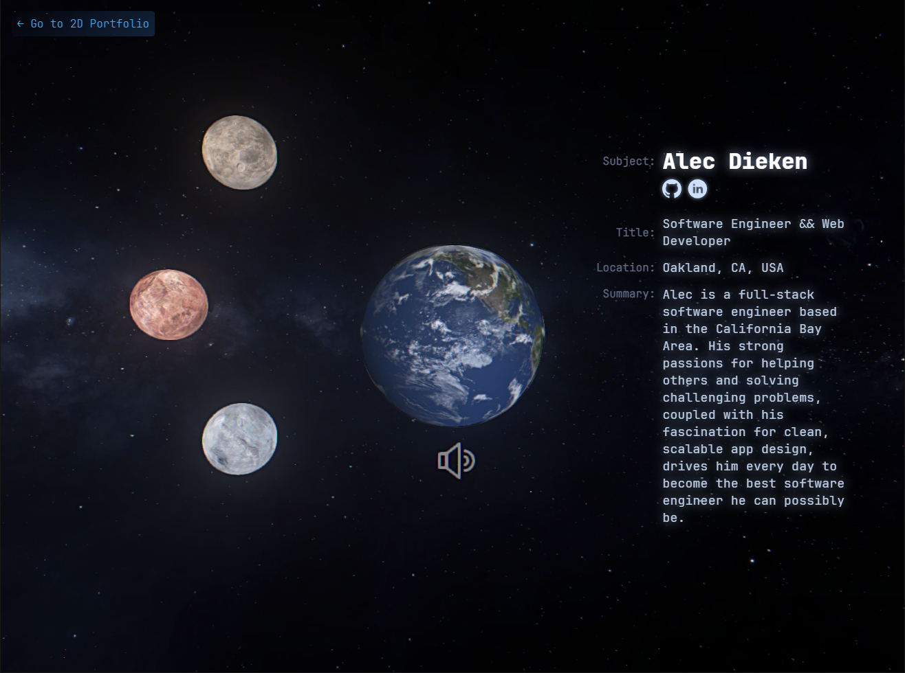

# ThreeJS Portfolio Showcase

🔗 - [https://3d.alecdieken.com](https://3d.alecdieken.com)
 ! Uses ~33mb of data !

Welcome to the Three.js Portfolio Showcase, an immersive 3D experience built with Three.js. This project demonstrates a sophisticated use of Three.js to create an atmospheric space scene, serving as a dynamic and interactive portfolio. Dive into a universe where each celestial body represents a different project or skill, showcasing the capabilities in 3D modeling, texturing, and the seamless integration of HTML elements with the Three.js canvas.

## Features

- **Atmospheric Space Scene**: A visually stunning space environment that sets the stage for showcasing portfolio pieces.
- **Interactive 3D Models**: Explore detailed 3D models representing different portfolio projects or skills.
- **Dynamic Scene Management**: Click-based navigation allows users to switch between different scenes, each highlighting a particular aspect of the portfolio.
- **Sound Control**: Users can control background music and sound effects, enhancing the immersive experience.
- **Advanced 3D Texturing**: Demonstrates proficiency in applying realistic textures to 3D models, adding depth and realism to the scene.
- **HTML and Three.js Integration**: Showcases the ability to blend HTML elements with the Three.js canvas for a seamless user interface.
 
More coming soon...
